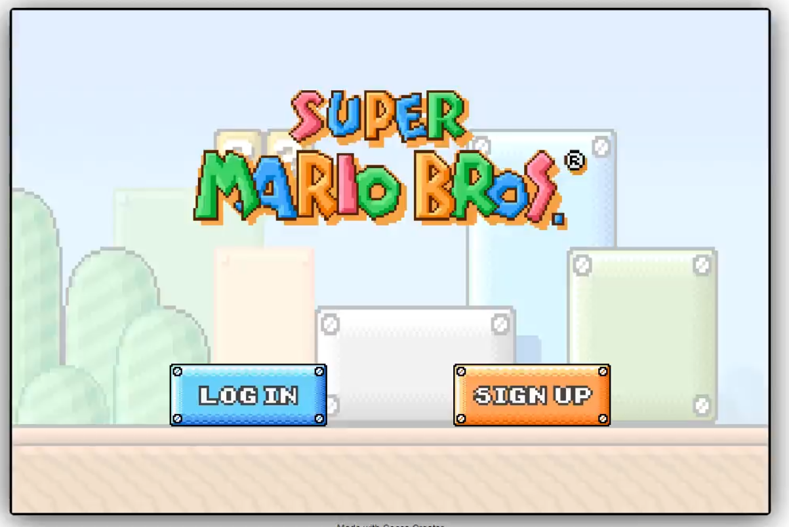
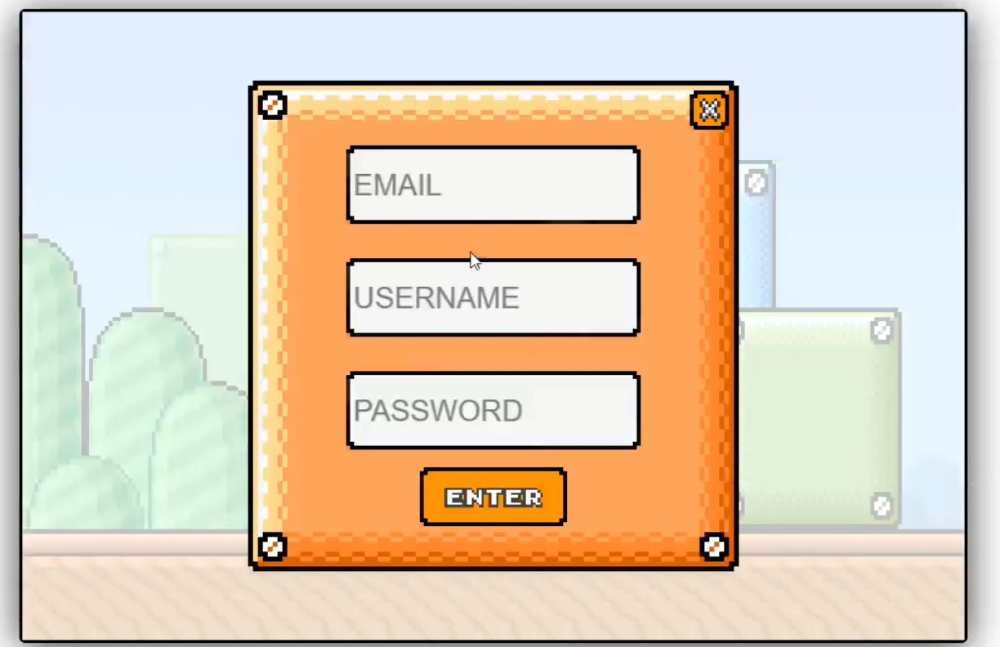
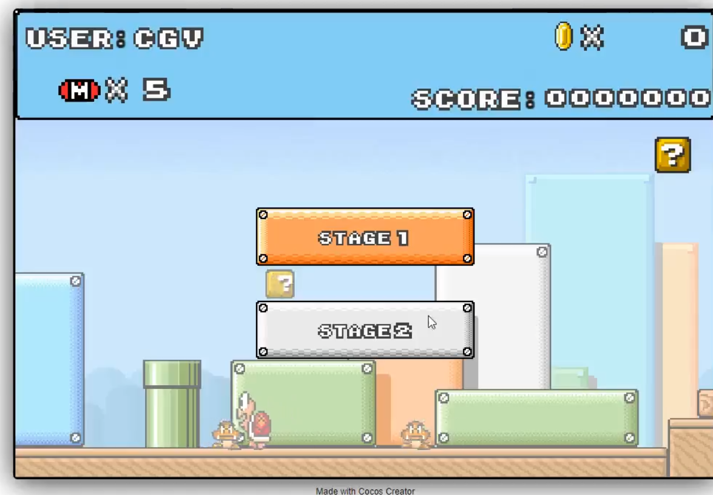
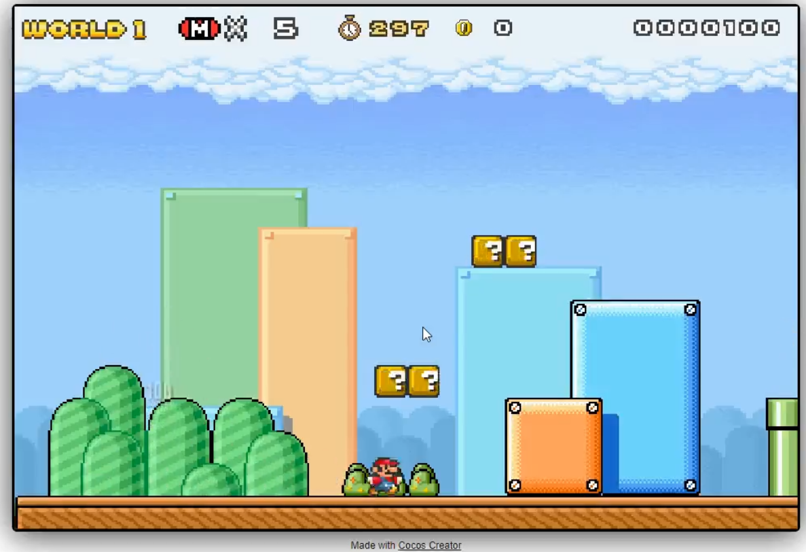
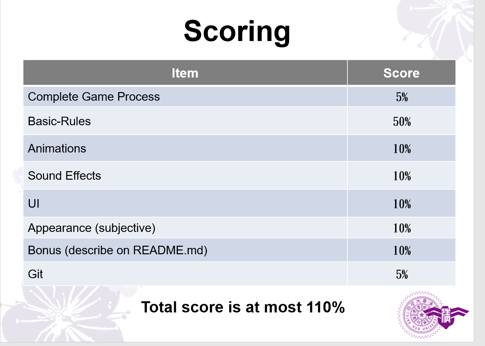

Assignment 02Web Mario

所有畫面

包含受擊、踩在怪物頭上，頂頭上方塊拿金幣...

Goal
Complete a “Mario style game” by Cocos Creator. 
You can use the materials TAs provide or download needed materials from some open-source webpages to beautify the appearance.
Report which items you have done (items in scoring page) and describing other functions or feature in REABME.md.

Scoring
Complete Game Process (5%)
Start menu
Level select
Game view(including game start / game over)
You need to control the game process according to current game & player status

Basic Rules (50%)
World Map: (10%)
The world must have correct physics properties, Ex: objects fall due to gravity, two different objects should collide with each other correctly, etc.
Background & Camera should move according to the player’s position.
At least 1 world maps.
Level Design: (5%)
The scene should have “Static” wall
The scene should include question blocks which can interact with the player

Basic Rules (50%)
Player: (15%)
Player should have correct physics properties.
User can control the player to move and jump by keyboard.
When player touches enemies or be attacked by enemies, it will get hurt or the number of its life will decrease.
When player get out of the bounds, the number of its life will decrease.
When player dies, it can reborn at the initial position.

Basic Rules (50%)
Enemies: (15%)
Enemies should have correct physics properties.
At least 1 type of enemies.
Only when player hits on their heads can kill them.

Question Blocks: (5%)
At least 1 type of blocks (super mushroom which makes Mario bigger).
Blocks can interact with player correctly.

Animations (10%)
Player has walk & jump animations (5%)
Enemies Animation (each for 2%, up to 5%)
Sound Effects (10%)
At least one BGM (2%)
Player Jump & die sound effects (3%)
Additional sound effects (each for 1%, up to 5%)
All sound effects can’t stop BGM
UI (10%)
Player life  (3%)
Player score  (5%)
Timer (2%)
Appearance(subjective) (10%)

Bonus (At most 10%)
Firebase (5%)
Deploy to Firebase page 
Membership mechanism 
Sign up, Login with firebase, save/restore game progress
Leaderboard (5%)
Multi-player game
Set up another backend server for online version (10%) 
Offline version (5%)
Others…? 

Git (5%)
Use Git to do version control
Commit regularly (not just on the last day!)

AI Usage 
If you utilize AI tools during development, you must include a report titled AI_reference.pdf in the root directory of your project. The report must include:
AI Tool(s) Used: Specify the model (e.g., ChatGPT, Gemini…)
Scope of Usage: For every segment of code generated or assisted by AI, provide:
Location: File name and specific line numbers (e.g., App.js, lines 45-82).
Prompt & Response: The exact prompt you used and the AI's output (Screenshots are highly recommended).
Refinement & Explanation: Show your modified version of the code and provide a brief explanation of why you made those changes and how the logic works.
Statement of Non-Usage: If you did not use any AI tools, simply state: "No AI tools were used in this assignment." inside the PDF.
We strongly suggest that you thoroughly analyze any code produced by AI and rewrite it using your own logic, in case that it may be flagged as plagiarism regardless of the documentation.

Reminder
Deploy your web page to Firebase page, and ensure it works correctly. 
Upload all source code to FTP. 
.html or .css, .js, .ts, etc.
source files
README.md
Zip all files into Assignment02_學號.zip
    (Ex: Assignment02_109062000.zip)
FIRM deadline: 2026/05/28 23:59 (commit time)
MD5 checksum (if you didn’t do this  -10%)
You will be graded ZERO under one of the following conditions
Missing the deadline, no matter what kind of reasons you have…
Plagiarism (抄襲), both the plagiarist (抄襲者) and accomplice (被抄襲者) will be graded zero.
Crashed program (e.g., 404 - Not Found)
Not upload the source files to FTP

Deploy your web page to Firebase page, and ensure it works correctly. (if you didn’t do this  0%)
Your main page should be named as “index.html”
Upload source code to FTP.
Compress files into Assignment02_學號.zip then upload
index.html, .css, .js, README.md, etc.
Do not add node_modules into zip file.(-5 if you upload node_modules)
If you upload the files again, please change the filename become Assignment02_學號_v?.zip (v? -> which version) 
MD5 checksum (if you didn’t do this  -10%)
FIRM deadline: 2026/05/28 23:59 (commit time)
Upload your MD5 and web link and GitHub / GitLab Url to eeclass
我需要這些音效欄位
1.player跳起來的
2.採到goomba頭上讓它消失的
3.往上彈questionbox冒出金幣的音效
4.吃到蘑菇變大時閃爍的音效
5.受到敵人傷害，閃爍時的音效
6.蘑菇從question block冒出來的音效
穿越終點的旗子sensor時的音效